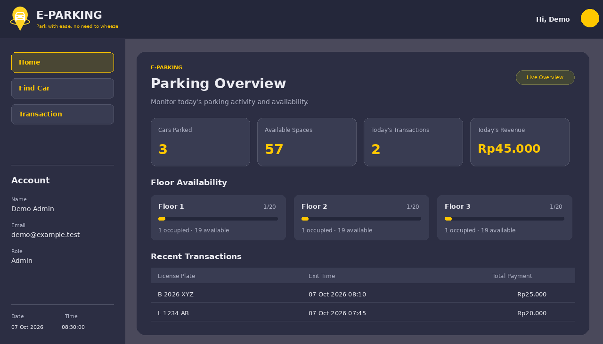
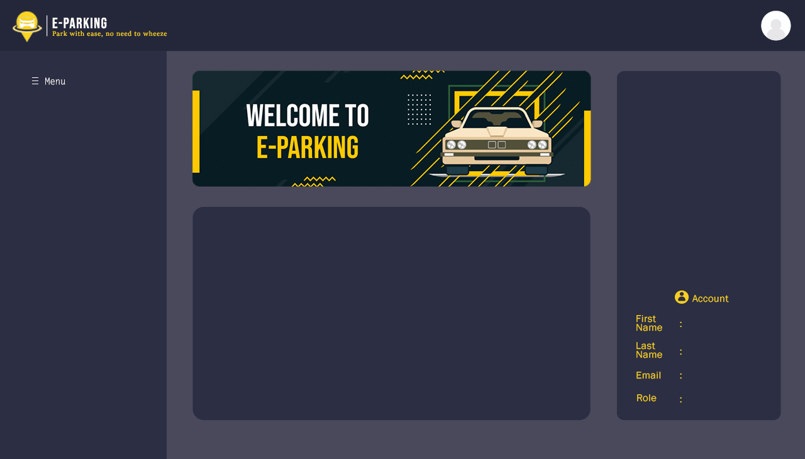

<div align="center">

# 🅿️ E-Parking

### Find your space. Park with ease.

A parking management demo for **web and Python / Tkinter**, with a refreshed purple-and-yellow interface, three parking floors, and dedicated user and admin workflows.

[](https://eparking-wawutriambodo.vercel.app)
[](e_parking.py)
[](web/)



**3 floors · 60 spaces · English / Indonesian · PDF invoices**

</div>

## What it does

E-Parking lets drivers choose an available parking space, enter their vehicle's license plate, find their parked car, and review a simulated parking payment. Admins get a parking overview, can inspect occupied spaces, and look up a vehicle's transaction by its plate.

Both interfaces follow the same visual concept: purple panels, yellow navigation and available spaces, high-resolution banners, and crisp native text. The Tkinter application now lives in a standalone Python module; the notebook launches that same current application.

## User experience

- **Create an account:** first and last name, email, role, password, and password confirmation. Login and signup are in English, with password visibility controls.
- **Start Parking:** select a yellow space, click **Done**, enter the license plate in the centered form, and confirm. Each of the three floors has 20 spaces.
- **Find My Car:** locate the active vehicle, highlighted in green.
- **Transaction:** review **License Plate**, **Parking Duration**, and **Total Payment**, then complete the simulated payment.
- **Invoice:** view the receipt and download a compact, single-page PDF. Completing a transaction releases the space and removes the plate from the active account panel.
- **Profile:** upload or change a photo, choose English / Indonesian, or log out. Clicking outside closes the profile menu.
- **Notifications:** feedback appears inside the application for three seconds.



## Admin experience

| Screen | What admins can do |
| --- | --- |
| Home | See cars currently parked, available spaces, today's completed transactions, and today's revenue. |
| Floor availability | Review occupied and available counts on each floor. |
| Recent transactions | See the latest completed payments with plate, exit time, and amount. |
| Find Car | Switch floors and click an occupied space, such as **E2**, to see the driver's name, email, and plate. |
| Transaction | Enter a plate and click **Search**. The billing details stay hidden until a matching active vehicle is found. |

The admin Home uses the sidebar for navigation, with no duplicate quick-access buttons. Transaction labels follow the selected language in both user and admin modes.

## Three-floor parking map

Spaces run from **A1 to L5**. Floor buttons are labeled **1**, **2**, and **3**, with an active state. Floor 1 has a green entrance and a red exit. Connections between floors use white floor markers; floor 3 leaves the right-hand exit area empty.


## Payments and invoices

The demonstration uses the original tariff:

```text
Fee = Rp20,000 + Rp5,000 × completed hours
```

No real money is collected. A completed transaction creates a receipt, releases the parking space, and updates the admin overview.


## Data and demo scope

The web app keeps accounts, parking sessions, photos, and receipts in that browser's local storage. The desktop app saves records locally in `~/.e-parking/records.json`, with profile photos alongside the records. Passwords use salted PBKDF2 hashes in both applications.

Web and desktop records are independent; they do not sync between devices or with each other. Role selection is part of this demonstration rather than production access control. Use sample details and a password you do not use elsewhere.

The original `E-Parking.csv` is preserved as a historical desktop dataset. It is not automatically loaded into the refreshed application.

## Current design assets

The old full-screen artwork in **Gambar/** has been replaced with refreshed reference layouts. Buttons and navigation assets have also been recreated. New high-resolution banner backgrounds live in `Gambar/assets/` and are used by Tkinter. Maps, account panels, tables, and controls are drawn as native elements so text stays sharp.

The images shown in this README are **rendered design references with illustrative demo values**, not runtime screenshots or live parking records. They can be regenerated with `python docs/render_designs.py`. Native widget appearance can vary by operating system.

## Project structure

```text
e_parking.py          Current Tkinter interface and compact PDF invoices
parking_core.py       Desktop accounts, booking, lookup, fees, and records
E-Parking.ipynb       Notebook launcher for the current desktop app
E-Parking.csv         Preserved historical dataset
requirements.txt     Desktop dependencies
Gambar/              Refreshed layout references, buttons, and HD assets
docs/                Current design references and their renderer
web/                 Browser application
  app.js             User/admin flows, dashboard, profile, and transactions
  style.css          Interface layout and styling
  logic.js           Parking rules and tariff
  invoice-pdf.js     Compact web invoice generation
tests/               Web and desktop parking regression tests
```

## Run locally

### Desktop

With Python 3.10 or newer and Tkinter installed:

```bash
python -m pip install -r requirements.txt
python e_parking.py
```

Alternatively, open `E-Parking.ipynb` from the project folder and run its launcher cell. On Linux, Tkinter may require the distribution's `python3-tk` package. The app needs a graphical display. Desktop records can be redirected with the `EPARKING_DATA_PATH` environment variable.

### Web

```bash
python -m http.server 3000 --directory web
```

Open `http://localhost:3000`, register a **User** or **Admin** demo account, and log in.

### Tests

```bash
npm test
python -m unittest discover -s tests -p 'test_desktop.py' -v
```

---

Created by **[Wawu Tri Ambodo](https://wawutriambodo.my.id)**

